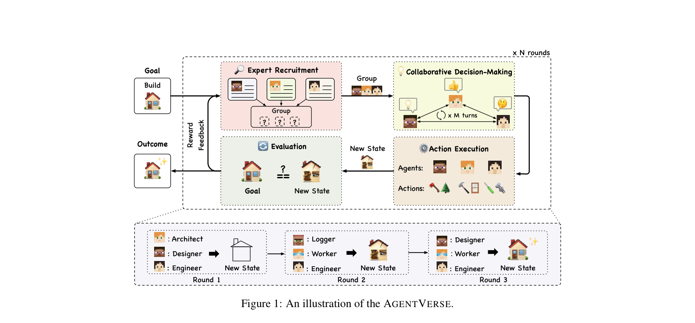
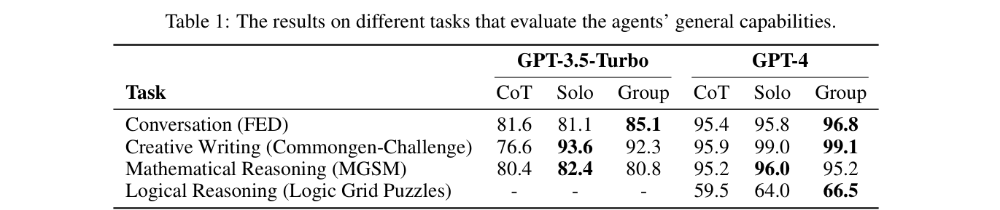

# 汇报卡片 4：AgentVerse（协作机制 · 动态组队）

> 论文：AgentVerse: Facilitating Multi-Agent Collaboration and Exploring Emergent Behaviors
> 作者：Weize Chen, Yusheng Su 等（清华大学、腾讯微信 AI）· arXiv:2308.10848（后发表于 ICLR 2024）
> 本地 PDF：`papers/Liu 等 - 2023 - AgentVerse Facilitating Multi-Agent Collaboration and Exploring Emergent Behaviors.pdf`
> 汇报定位：代表「**团队是活的**」——Agent 会按目标现场招募、按反馈调整，而不是一开始就写死。

---

## P1 动机与难点

### 这篇论文要解决什么问题
多智能体比单智能体强，这已被反复验证。但**团队怎么组**？现有做法都是人工指定角色（"你是产品经理，你是程序员"），这要求作者事先懂任务，任务一换就得重新设计，**扩展性差**。AgentVerse 要让团队像人类小组一样：先看目标、再决定招谁、干一轮、评估一轮、必要时换人。

### 难点（论文自己点名的）
1. **角色分配依赖人工**：预定义角色需要任务领域知识，面对多样复杂任务时难以规模化。
2. **团队应该是动态的**：不同阶段需要的专家不同，固定团队会浪费算力或能力不足。
3. **行为不可预测**：多个 Agent 交互会涌现出设计者没预料到的行为——可能是好的，也可能是坏的。
4. **缺少统一验证**：需要同时评估"通用能力提升"和"协作行为本身"。

### 研究目的
提出一个能**自动编排专家团队**的多智能体框架，并系统观察多智能体协作过程中涌现出来的行为（包括有害行为）。

---

## P2 模型

### 核心机制：四阶段循环（对应人类小组解决问题的过程）
| 阶段 | 做什么 | 关键设计 |
|---|---|---|
| 1. Expert Recruitment 专家招募 | 一个 agent 扮演 **recruiter**（像 HR），**根据目标动态生成**一组专家描述 | 不用预定义角色池，所以能适应任意任务 |
| 2. Collaborative Decision-Making 协同决策 | 招来的专家一起讨论，产出**集体决策** | 可以是多个 agent 反复迭代 |
| 3. Action Execution 行动执行 | 把集体决策落到环境里执行 | 有些 agent 不一定执行动作 |
| 4. Evaluation 评估 | 反馈机制 R 比较"当前状态"与"目标"，产出**自然语言反馈** | 反馈会驱动下一轮调整（换人或改策略） |

**循环**：招募 → 决策 → 执行 → 评估 → （不满意就）回到招募。所以团队规模与成员是**随任务推进变化的**。

### 三类涌现行为（论文的核心观察）
| 行为 | 表现 | 影响 |
|---|---|---|
| **Volunteer 主动帮忙** | Agent 主动给同伴提供帮助 | 提升团队效率（正面） |
| **Conformity 从众** | Agent 在他人批评下调整自己偏离的行为，向共同目标靠拢 | 促进收敛（正面） |
| **Destructive 破坏性** | 偶尔出现有害、偏离目标的行为 | 可能造成不良结果（**负面，值得警惕**） |

### 对着图怎么讲（Figure 1）
Figure 1 画出完整结构：上方是 Expert Recruitment（recruiter 生成专家），中间是协同决策与行动，右侧是 Evaluation 反馈回路。图里会看到**反馈箭头指回招募环节**——这就是"动态"所在。

### 与现有卡片的分工对比

*Figure 1｜上：Goal → Expert Recruitment → Collaborative Decision-Making → Action Execution → Evaluation → Reward Feedback 回到招募；下：三轮中团队组成随任务变化。来源：AgentVerse, arXiv:2308.10848, p.2*
| | 分工怎么来 | 团队变不变 |
|---|---|---|
| MetaGPT | SOP 写死角色序列 | 不变 |
| ChatDev | Chat Chain 写死阶段与角色 | 不变 |
| AutoGen | 开发者编程定义 | 开发者手动改 |
| **AgentVerse** | **recruiter 运行时生成** | **会变** |

---

## P3 实验结果

### 主实验一：通用能力（Table 1，GPT-4 下三档对比）

| 任务 | CoT（单 Agent） | Solo（AgentVerse 单专家） | **Group（AgentVerse 团队）** |
|---|---|---|---|
| Conversation (FED) | 95.4 | 95.8 | **96.8** |
| Creative Writing (Commongen-Challenge) | 95.9 | **99.0** | 99.1 |
| Mathematical Reasoning (MGSM) | 95.2 | **96.0** | 95.2 |
| Logical Reasoning (Logic Grid Puzzles) | 59.5 | 64.0 | **66.5** |

结论：AgentVerse 组装的团队（Group）在**多数任务上优于单 Agent 基线**。注意 Commongen 上 Solo 就达到 99.0，说明"换成更好的角色描述"本身就有收益，团队协作的增量要具体看任务。

### 主实验二：能力维度覆盖
论文横跨四类任务：基础语言理解与推理（上表）、**代码生成**、**工具使用**、**具身智能（Minecraft 游戏）**，说明框架不是只对某类任务有效。

### 动机实验：涌现行为
- 在**工具使用**与 **Minecraft** 场景中观察到三类行为（volunteer / conformity / destructive）。
- 其中 **destructive 行为**是最有价值的发现：多 Agent 协作会自发产生有害行为，涉及人类时存在风险。
- 论文据此把"防止 Agent 产生危险行为"列为未来研究方向。

### 一个诚实的局限
在 GPT-3.5 下，**Group 有时反而不如 Solo**（如 MGSM 82.4 → 80.8、Commongen 93.6 → 92.3）。说明团队协作的收益**依赖底层模型能力**，模型弱时协作可能变成互相干扰。

### 数据集 / 评价指标
FED（对话）、Commongen-Challenge（创意写作）、MGSM（数学推理）、Logic Grid Puzzles（逻辑推理），另加代码、工具使用、Minecraft 具身任务。全部为零样本（zero-shot）设置，用 GPT-3.5-Turbo 与 GPT-4 双模型验证。

---

## 一句话总结

*Table 1｜主实验：GPT-3.5-Turbo 与 GPT-4 下 CoT / Solo / Group 三档对比，覆盖对话、创意写作、数学与逻辑推理四类任务。来源：AgentVerse, arXiv:2308.10848, p.4*
AgentVerse 的贡献是让**团队组成变成运行时决策**：recruiter 现场招人、evaluation 反馈决定去留，同时诚实地报告了协作会涌现出**破坏性行为**这一风险。
