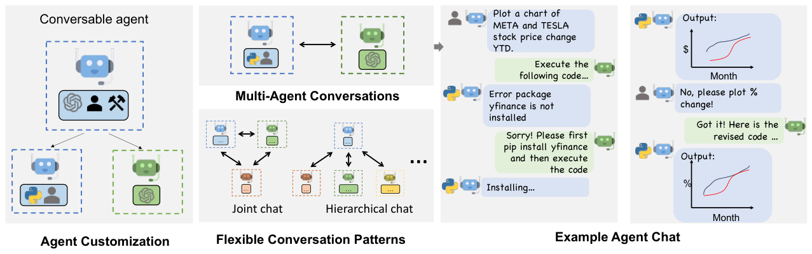
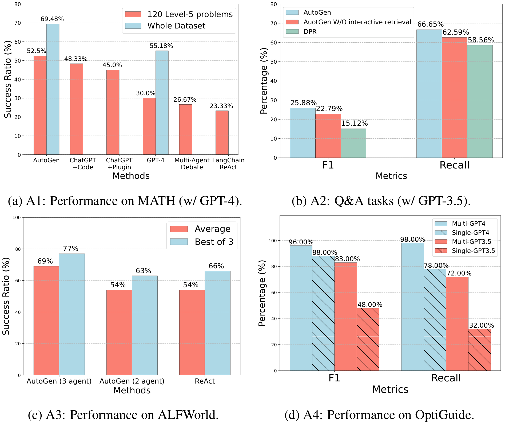

# 汇报卡片 1：AutoGen（协作机制 · 可编程编排）

> 论文：AutoGen: Enabling Next-Gen LLM Applications via Multi-Agent Conversation
> 作者：Qingyun Wu 等（Microsoft Research 等）· arXiv:2308.08155
> 本地 PDF：`papers/AutoGen 等 - 2023 - AutoGen Enabling Next-Gen LLM Applications via Multi-Agent Conversation.pdf`
> 汇报定位：代表「**把多智能体协作变成可编程的运行时**」这一条路线。

---

## P1 动机与难点

### 这篇论文要解决什么问题
搭建 LLM 应用时，真实任务往往需要「模型 + 工具 + 人」混合参与，而现有做法要么写死流程（难以复用），要么让 Agent 自由聊天（不可控）。AutoGen 要提供一套**可编程的多智能体对话框架**：开发者用最少的代码定义 Agent 和它们的对话模式，把复杂任务拆给多个 Agent 共同完成。

### 难点（论文自己点名的）
1. **Agent 要能被定制**：Agent 应可以是 LLM、工具、人，或几者的组合，而不是只能是一种。
2. **对话模式要能灵活定义**：既有双 Agent 一问一答，也有群聊、层级聊天、联合聊天，不能只有一种拓扑。
3. **控制权要在「自然语言」与「代码」之间自由切换**：很多步骤需要程序化控制（比如执行代码、判断是否终止），纯聊天表达不了。
4. **人要在回路里**：不能假设全自动，人随时可以介入。

### 研究目的
提出一个通用框架，让「多个可对话 Agent 之间的交互」成为一等公民（first-class），使开发者能像写程序一样编排多智能体协作。

---

## P2 模型

### 核心概念
- **Conversable Agent（可对话 Agent）**：框架的基本单元。它有一个统一的 `generate_reply` 接口，底层可以是 LLM、也可以是任意 Python 代码，因此 LLM Agent、工具 Agent、人类代理在框架里是同一种东西。
- **Auto-reply（自动回复机制）**：每个 Agent 收到消息后自己决定下一步——是继续回复、调用工具、还是把控制权交出去。这是**去中心化、模块化**的关键：没有中央调度器，协作从「消息 + 自动回复」中涌现。
- **Conversation Programming（对话编程）**：开发者通过注册回复函数、设置终止条件来定义协作流程；框架原生支持在自然语言回复与程序化控制之间切换。
- **灵活的对话模式**：双 Agent 对话、群聊（Group Chat）、层级聊天（Hierarchical Chat）、联合聊天（Joint Chat）。

### 对着图怎么讲（Figure 1 / Figure 2）
- Figure 1：左边是「Agent 定制」（LLM / 工具 / 人 / 组合），上中是 Agent 之间对话，右边是「人可参与的群聊」，下中是「灵活对话模式」。
- Figure 2：展示如何用几行代码程序化地定义一个多智能体对话。
- 一句话：**别人在设计 Agent 的智能，AutoGen 在设计 Agent 之间的对话。**

### 与 MetaGPT / CAMEL 的区别


*Figure 1｜左：Agent 定制（LLM/工具/人）· 中：多智能体对话与灵活对话模式 · 右：一班完整的 Agent 对话实例。来源：AutoGen, arXiv:2308.08155, p.1*
| | CAMEL | MetaGPT | AutoGen |
|---|---|---|---|
| 协作怎么来 | 固定两个角色对话 | 预定义 SOP 流水线 | 开发者编程定义对话模式 |
| 控制方式 | 角色 + 终止标记 | 流程约束 | 事件驱动 + 可编程回复 |
| 灵活性 | 低（只有双 Agent） | 中（流程静态） | 高（拓扑可编程） |

---

## P3 实验结果

### 主实验：六类应用端到端验证（A1–A6）
论文没有只跑一个 benchmark，而是用 AutoGen 搭了六个应用，证明框架的通用性：
- **A1 数学问题求解**：开箱即用即可达到有竞争力的结果。
- **A2 检索增强问答与代码生成**：支持 RAG，并能实现「交互式检索」这一新范式（with vs without interactive retrieval 有提升）。
- **A3 ALFWorld 具身任务**：加入 grounding agent 后，平均带来约 **15%** 的性能提升。
- **A4 多智能体编码（OptiGuide）**：多个 Agent 分工（Commander / Writer / Safeguard）协同完成供应链优化问答。
- **A5 动态群聊**：可动态决定下一个发言者。
- **A6 对话式国际象棋**：用 Agent 表达棋盘规则，无需额外硬编码。

### 动机实验（消融 / 对照）
| 对照 | 结果 | 说明什么 |
|---|---|---|
| ALFWorld：有 grounding agent vs 无 | 平均 +15% | 背景常识在关键节点能阻止系统沿着错误计划继续，避免错误循环 |
| 检索：交互式检索 vs 静态检索 | 交互式更高 | 让 Agent 主动追问检索内容比一次性注入更有效 |
| 象棋：有 board agent vs 无 | 有 board agent 更好 | 把「规则校验」独立成 Agent 比塞进玩家 Agent 更可靠 |
| 群聊 vs 双 Agent 对话 | 群聊在需要多视角时更好 | 对话拓扑要按任务选 |

### 数据集 / 评价指标
MMLU 等数学与问答数据集、ALFWorld（134 个未见任务）、OptiGuide 供应链任务、MiniWob++；指标为准确率、成功率、F1 / Recall、成本。

---

## 一句话总结


*Figure 4｜(c) ALFWorld：加入 grounding agent 后平均 +15%；(d) OptiGuide 多 Agent 分工结果。来源：AutoGen, arXiv:2308.08155, p.7*
AutoGen 的贡献不是让 Agent 更聪明，而是**把「Agent 之间怎么对话」变成可编程的接口**，让协作拓扑成为设计变量。

---

## 被追问时怎么讲（补充）

**问：Conversable Agent 是什么？**
框架里只有一种实体，有统一的三接口 `send` / `receive` / `generate_reply`。关键是 `generate_reply`——收到消息后"该说什么、下一步做什么"全写在这里。底层可以是 LLM、代码或人，所以在 AutoGen 里**模型、工具、人是同一种东西**。

**问：什么叫"没有中央调度器"？**
因为系统里没有主持人决定下一个谁说话。论文原话：*"Once an agent receives a message from another agent, it automatically invokes generate_reply and sends the reply back to the sender unless a termination condition is satisfied."* 收到消息 → 自动想回复 → 自动发回去。每个 Agent 自己决定下一句发给谁，而它的决定取决于刚收到的那句话——这叫 **conversation-driven control flow（对话驱动的控制流）**。

**用 Figure 2 的对话讲最清楚**：

```
A：画一下 META 和 TESLA 今年股价
B（generate_reply）→ 请执行这段代码
A → 去执行 → 报错：yfinance 没装
A → 把「这条报错」当消息发回给 B
B（generate_reply）→ 先 pip install yfinance 再执行
A → 装包、重跑
```

整条链能自己跑下去，是因为**报错也是一条消息**；没有任何地方写死"如果报错就装包"，是消息把流程推下去的。

**"可编程"编在哪**：定义 Agent + 注册自定义回复函数 + 发起对话，再配终止条件与轮数上限。**拓扑是开发者写出来的，不是框架固定的**。
对比 MetaGPT：流程是框架写死的 SOP；AutoGen 是你写代码 + Agent 运行时自己决定。
### 补充：Figure 4(d) 怎么读（Multi / Single 是啥）

图例里没有"AutoGen"，**Multi 就是 AutoGen 的多智能体设计**（Commander + Writer + Safeguard），**Single 是单智能体**做同样的任务。

任务是 OptiGuide 供应链问答，例："如果禁止从供应商 1 运到烘焙厂 2，会怎样？"
流程：用户 → Commander → Writer 写代码 → Commander 交 Safeguard 查安全 → 通过才执行 → Writer 解释结果（"总成本上涨 10.5%"）→ Commander 回给用户；不安全就带调试信息退回重写。

| | F1 | Recall |
|---|---|---|
| Multi-GPT4 | **96.00%** | **98.00%** |
| Single-GPT4 | 88.00% | 78.00% |
| Multi-GPT3.5 | **83.00%** | **72.00%** |
| Single-GPT3.5 | 48.00% | 32.00% |

**多智能体在每一对里都赢，而且模型越弱提升越大**（GPT-3.5 的 Recall 从 32% → 72%）。论文图注：*"(d) shows that a multi-agent design is helpful in boosting performance in coding tasks that need safeguards."*
