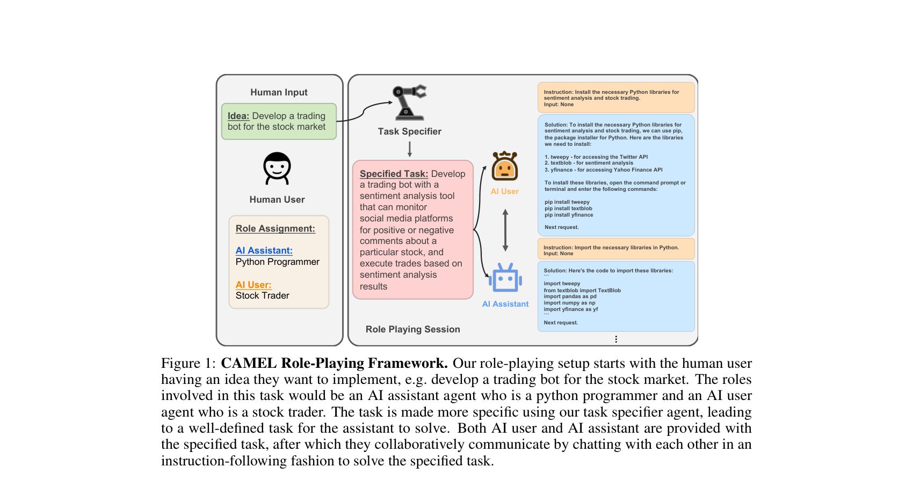
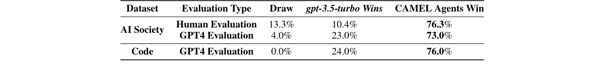
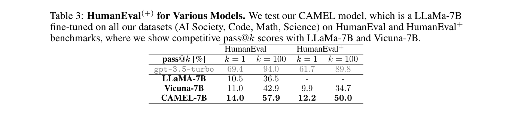

# 汇报卡片 A2：CAMEL（协作机制 · 角色扮演）

> 论文：CAMEL: Communicative Agents for "Mind" Exploration of Large Language Model Society
> 作者：Guohao Li, Hasan Abed Al Kader Hammoud, Hani Itani, Dmitrii Khizbullin, Bernard Ghanem（KAUST）· NeurIPS 2023 · arXiv:2303.17760
> 本地 PDF：`papers/Li 等 - 2023 - CAMEL Communicative Agents for Mind Exploration of Large Language Model Society.pdf`
> 汇报定位：代表「**两个 Agent 靠角色设定自主协作**」这条路线——结构最简单、成本最低，也是我自己复现过的框架。
> 我的复现记录见：`notes/CAMEL复现总结.md`

---

## P1 动机与难点

### 这篇论文要解决什么问题
chat-based LLM 解决复杂任务，**成功高度依赖人类一步步引导对话**，费时费力；而且人工介入限制了对"多智能体社会"的大规模研究。CAMEL 要问：能不能让两个 communicative agent **在没有人类持续介入的情况下自主协作**？

### 难点（论文自己点名的）
1. **角色反转（role flipping）**：Assistant 反过来向 User 下指令，导致角色混乱、任务跑偏。
2. **Assistant 复述指令**：Assistant 只是把 User 的话重复一遍，任务不推进。
3. **敷衍回复（flake replies）**：看起来在回答，实际没有可执行内容。
4. **终止控制**：对话何时算完成？需要一个显式约定，否则会无效循环。
5. **效果依赖基础模型能力**：底层 LLM 的指令遵循能力直接决定协作质量。

### 研究目的
提出 **Role-Playing（角色扮演）+ Inception Prompting（初始启发式提示）** 框架：人类只在开始时设定想法与角色，之后两个 Agent 自主多轮对话直到任务完成；同时用这个机制**批量生成对话数据**，用于研究"Agent 社会"的行为。

---

## P2 模型

### 核心机制
| 机制 | 做什么 |
|---|---|
| **角色分配** | 指定两个角色（如 Python 程序员 / 股票交易员），一个扮 AI User，一个扮 AI Assistant |
| **Task Specifier** | 把人类一句模糊想法**扩展成清晰、具体的任务提示词**（相当于增强版"想清楚要做什么"） |
| **AI User（Ƥ_U）** | 提需求、给指令、推动进度——扮演人类 |
| **AI Assistant（Ƥ_A）** | 执行、产出方案——扮演专家 |
| **指令跟随式对话** | 两个 Agent 按角色设定多轮往返（User 给指令 Iₜ → Assistant 给方案 Sₜ），直到完成 |
| **终止标记** | 约定 `CAMEL_TASK_DONE`，出现即结束 |

**关键点：人类只出现在最左边一次**（给想法 + 分角色），后面全靠两个 Agent 自己来回——这就是它省人力的地方。

### 对着图怎么讲（Figure 1）
Figure 1 左边是"人类输入"（想法 + 角色分配），中间是 Task Specifier 把想法变成具体任务，右边是 AI User 与 AI Assistant 的多轮协作（User 说"请写一个能监控社交媒体情绪的交易机器人"，Assistant 给出 Python 实现）。**这张图讲"人类退出去之后协作怎么继续"**。

*Figure 1｜CAMEL 角色扮演流程：人类想法 + 角色分配 → Task Specifier 生成具体任务 → User/Assistant 多轮协作。来源：CAMEL, NeurIPS 2023, p.4*

### 与其它卡片的分工对比
| | CAMEL | MetaGPT | AutoGen |
|---|---|---|---|
| 协作怎么来 | 固定两个角色对话 | 预定义 SOP 流水线 | 开发者编程定义对话模式 |
| 灵活性 | 低（只有双 Agent） | 中（流程静态） | 高（拓扑可编程） |
| 成本 | 最低 | 最重 | 中 |

---

## P3 实验结果

### 主实验一：CAMEL 双 Agent vs 单模型单次回答

*Table 1｜Agent 评测结果：CAMEL 双 Agent 方案 vs gpt-3.5-turbo 单次回答。来源：CAMEL, NeurIPS 2023, p.9*

| 数据集 | 评测方式 | 平局 | gpt-3.5-turbo 胜 | **CAMEL 胜** |
|---|---|---|---|---|
| AI Society | 人工评测（453 份投票） | 13.3% | 10.4% | **76.3%** |
| AI Society | GPT-4 评测 | 4.0% | 23.0% | **73.0%** |
| Code | GPT-4 评测 | 0.0% | 24.0% | **76.0%** |

**最值得讲的两点**：
1. **协作 vs 单模型：76.3% vs 10.4%**，差距非常大。
2. **人工评测与 GPT-4 评测结论高度一致**，说明自动评委在这类任务上可信——这对后续做自动化实验很重要（我自己的复现也正是靠这个思路做对照）。

### 主实验二：生成数据的下游价值（微调 LLaMA-7B）

*Table 3｜HumanEval(+)：CAMEL-7B 是用自生成数据（AI Society + Code + Math + Science）微调的 LLaMA-7B。来源：CAMEL, NeurIPS 2023, p.10*

| pass@k [%] | HumanEval k=1 | HumanEval k=100 | HumanEval⁺ k=1 | HumanEval⁺ k=100 |
|---|---|---|---|---|
| gpt-3.5-turbo | 69.4 | 94.0 | 61.7 | 89.8 |
| LLaMA-7B | 10.5 | 36.5 | — | — |
| Vicuna-7B | 11.0 | 42.9 | 9.9 | 34.7 |
| **CAMEL-7B** | **14.0** | **57.9** | **12.2** | **50.0** |

**说明什么**：用 CAMEL 自动生成的对话数据微调 7B 小模型，HumanEval pass@100 从 36.5 提到 57.9 —— **这套机制能产出有训练价值的数据**，不只是"看起来在协作"。

### 动机实验：机制验证与失效观察
- **递进微调**：按 AI Society → Code → Math → Science 顺序加入数据集，模型在对应领域表现持续提升（Table 2），证明生成数据分领域有效。
- **失效模式**：论文明确记录了 role flipping、Assistant 复述指令、flake replies 三类问题，并给出缓解做法（限制 Assistant 不反问、明确角色边界、显式终止标记）。
- **我的复现对照**：在工作区用 DeepSeek 后端复现了 RolePlaying 双 Agent、Workforce 自动分工、多智能体辩论三条链路，验证了"任务分解—执行—汇总"和"文件传递"机制可用，也复现了终止控制需要显式约定的问题（见 `notes/CAMEL复现总结.md`）。

### 数据集 / 评价指标
自生成四类数据集（AI Society / Code / Math / Science）；评测用**人工投票胜率**与 **GPT-4 评委胜率**，下游用 HumanEval 与 HumanEval⁺ 的 pass@k。

---

## 一句话总结
CAMEL 用最小结构证明了**自主协作是可行的**：人类只说一次想法并分好角色，两个 Agent 就能把任务推进到完成；而且它生成的对话数据还能反过来提升小模型——但稳定协作依赖提示设计，不是自动成立。
