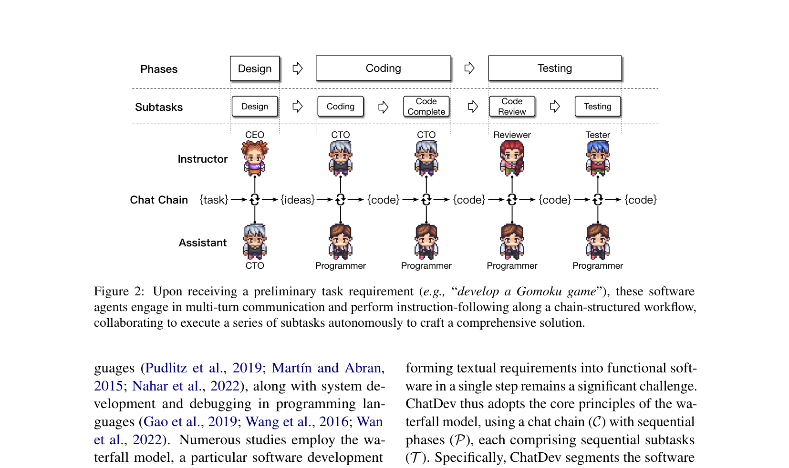
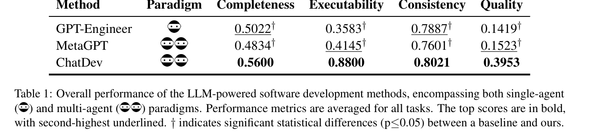

# 汇报卡片 2：ChatDev（协作机制 · 聊天链）

> 论文：ChatDev: Communicative Agents for Software Development
> 作者：Chen Qian 等（清华大学等）· ACL 2024 · arXiv:2307.07924
> 本地 PDF：`papers/Chen 等 - 2023 - ChatDev Communicative Agents for Software Development.pdf`
> 汇报定位：代表「**用聊天链把开发流程拆成原子对话**」这一条路线，与 MetaGPT 的 SOP 路线**正面对照**。

---

## P1 动机与难点

### 这篇论文要解决什么问题
软件开发需要多种技能的人协作。已有深度学习做法是**分别**优化设计、编码、测试各阶段——但每个阶段都要单独设计模型，导致阶段之间**技术不一致、流程碎片化**。ChatDev 要问：能不能用**同一种语言（自然语言 + 编程语言）**贯穿整个开发流程，让多个 LLM Agent 靠对话把软件做出来？

### 难点（论文自己点名的）
1. **阶段割裂**：各阶段模型不统一，前一阶段的输出无法顺畅进入下一阶段。
2. **说什么（what to communicate）**：Agent 之间如果没有约定的对话流程，容易跑偏、跳步、漏掉测试。
3. **怎么说（how to communicate）**：Agent 在信息不足时会「硬答」，凭空编造外部依赖和接口，即**幻觉**。
4. **一个矛盾点**：论文发现自然语言适合系统设计与需求讨论，但**调试时编程语言更有效**——两种语言各有适用面，框架要同时容纳。

### 研究目的
提出一条**用语言统一的软件生产流水线**：用 chat chain 规定「说什么」，用 communicative dehallucination 规定「怎么说」，让整个开发流程由多轮对话驱动。

---

## P2 模型

### 核心机制一：Chat Chain（聊天链）
把软件开发拆成**原子化的子任务**，每个子任务对应一次「双 Agent 会话」：
- **阶段划分**：Design（设计）→ Coding（编码）→ Testing（测试），共 3 个阶段、5 个子任务。
- **角色**：CEO、CTO、程序员（programmer）、评审员（reviewer）、测试员（tester）。
- **每个子任务内部**用**角色扮演式双 Agent 对话**（Instructor 提要求 / Assistant 执行），这个设计直接继承自 CAMEL。
- **对话有终止条件**：代码修改两轮不变，或超过 10 轮通信，就结束该子任务并产出结论。
- **产出以 `<SOLUTION>` 标记**，便于程序自动抽取结果。

### 核心机制二：Communicative Dehallucination（交际式去幻觉）
- 常规模式：`⟨指令 → 回答⟩`，Assistant 拿到模糊指令也必须立刻作答，于是编造。
- ChatDev 模式：允许多一次**角色反转**——Assistant 先反过来向 Instructor **索要更具体的信息**（例如某个外部依赖的准确名称和类名），拿到后再给正式回答。
- 一句话：**「不确定就先问，不要先编」**，用多一轮对话换掉一次幻觉。

### 对着图怎么讲（Figure 2）
Figure 2 画出完整链路：接到需求（如"开发一个五子棋游戏"）→ CEO 定方向 → CTO 做技术设计 → 程序员写代码 → 评审员审 → 测试员跑 → 迭代回到编码。每个箭头都是一次双 Agent 会话。

### 与 MetaGPT 的关键差异

*Figure 2｜Chat Chain：设计→编码→测试 3 阶段 5 子任务，每个子任务由 Instructor 与 Assistant 双 Agent 完成。来源：ChatDev, ACL 2024, p.3*
| | MetaGPT | ChatDev |
|---|---|---|
| 协调靠什么 | SOP + 结构化文档（PRD、设计、任务列表） | Chat Chain + 多轮自然语言对话 |
| 传递什么 | 结构化中间交付物 | 对话（自然语言 57.5% + 编程语言，见 Figure 3） |
| 防幻觉 | 可执行反馈（跑测试读错误） | 交际式去幻觉（先问再答） |
| 同样做软件开发，但**一个靠文档，一个靠对话** | | |

---

## P3 实验结果

### 主实验一：四项指标全面领先（Table 1）

| 方法 | Paradigm | Completeness | Executability | Consistency | Quality |
|---|---|---|---|---|---|
| GPT-Engineer | 单 Agent | 0.5022 | 0.3583 | 0.7887 | 0.1419 |
| MetaGPT | 多 Agent | 0.4834 | 0.4145 | 0.7601 | 0.1523 |
| **ChatDev** | 多 Agent | **0.5600** | **0.8800** | **0.8021** | **0.3953** |

**最值得讲的一个数字**：Executability **0.88 vs 0.41**——ChatDev 生成的软件能直接编译运行的比例是 MetaGPT 的两倍多。Quality 是三项的乘积，因此 0.3953 vs 0.1523，差距被放大到 2.6 倍。

### 主实验二：两两偏好评测（Table 2）

| 对手 | 评委 | 对手胜 | ChatDev 胜 | 平局 |
|---|---|---|---|---|
| GPT-Engineer | GPT-4 | 22.50% | **77.08%** | 0.42% |
| GPT-Engineer | 人类 | 9.18% | **90.16%** | 0.66% |
| MetaGPT | GPT-4 | 37.50% | **57.08%** | 5.42% |
| MetaGPT | 人类 | 7.92% | **88.00%** | 4.08% |

人类评委比 GPT-4 评委更偏向 ChatDev，说明结论不是自动评测的偏差。

### 动机实验：消融（Table 4）

| 配置 | Completeness | Executability | Consistency | Quality |
|---|---|---|---|---|
| 只做 ≤Complete | 0.6250 | 0.7400 | 0.7978 | 0.3690 |
| ≤Review（加评审） | 0.5750 | 0.8100 | 0.7980 | 0.3717 |
| ≤Testing（全流程） | 0.5600 | **0.8800** | 0.8021 | **0.3953** |
| 去掉 CDH（去幻觉） | 0.4700 | 0.8400 | 0.7983 | 0.3094 |
| 去掉角色分工 | 0.5400 | **0.5800** | 0.7385 | **0.2212** |

三条结论：
1. **测试环节是 Executability 的主要来源**（0.74 → 0.88）。
2. **去掉交际式去幻觉，Quality 从 0.3953 掉到 0.3094**（-22%），证明「先问再答」确实在减少幻觉。
3. **去掉角色分工，Executability 0.88 → 0.58、Quality 0.3953 → 0.2212**，证明多角色不是装饰，是性能来源。

### 代价（Table 3，诚实交代）
| 方法 | 耗时(s) | Token | 文件数 | 代码行数 |
|---|---|---|---|---|
| GPT-Engineer | 15.6 | 7,183 | 3.9 | 70 |
| MetaGPT | 154.0 | 29,279 | 4.4 | 153 |
| ChatDev | 148.2 | 22,949 | 4.4 | 144 |

多智能体更慢、更贵，但产出规模更大（代码行数是单 Agent 的 2 倍）。论文的态度：**当前阶段基本特征比时间和经济成本更重要**。

---

## 一句话总结

*Table 1｜主实验：ChatDev 在 Completeness / Executability / Consistency / Quality 四项全部最高，Executability 0.8800 vs MetaGPT 0.4145、GPT-Engineer 0.3583。来源：ChatDev, ACL 2024, p.6*
ChatDev 证明了**语言本身就是协作协议**：chat chain 管「说什么」，交际式去幻觉管「怎么说」，两者合起来让对话直接产出可运行的软件。
