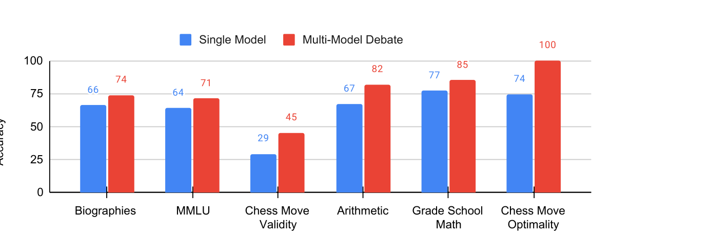
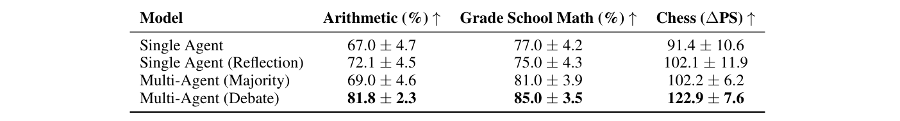

# 汇报卡片 6：Multiagent Debate（协作机制 · 对抗式辩论）

> 论文：Improving Factuality and Reasoning in Language Models through Multiagent Debate
> 作者：Yilun Du, Shuang Li, Antonio Torralba, Joshua B. Tenenbaum, Igor Mordatch（MIT CSAIL / Google Brain）· arXiv:2305.14325（ICML 2024）
> 本地 PDF：`papers/Du 等 - 2023 - Improving Factuality and Reasoning in Language Models through Multiagent Debate.pdf`
> 汇报定位：代表「**对抗式协作**」——现有卡片里唯一非合作的一类。Tran 2025 把协作类型分为合作 / 竞争 / 竞合，这张卡补的就是"竞争"。

---

## P1 动机与难点

### 这篇论文要解决什么问题
单个 LLM 在数学推理和事实性问答上会给出错误答案，而且**自己检查不出来**。已有做法（CoT、self-consistency、self-reflection）都是让**同一个模型**换个姿势再想一遍——错的地方往往还是错。这篇论文换思路：让**多个模型实例互相看对方的答案和推理过程**，多轮辩论后收敛到共同答案。

### 难点（论文自己点名的）
1. **自省有天花板**：让模型批评自己的输出，只能做到"看看有没有明显问题"，改不了根本性的推理错误。
2. **同一模型也会有分歧**：论文发现**即使是同一个模型类的不同实例**，给出的答案也千差万别——分歧是资源，不是噪声。
3. **幻觉难以检出**：模型会编造事实（尤其人物传记里的机构和年份），并且**不同实例编得还不一样**，缺乏交叉验证机制就发现不了。
4. **必须能用黑盒模型**：方法不能依赖模型权重或重新训练，要能直接套在现有模型上。

### 研究目的
提出一种**多智能体辩论**机制：多个模型实例各自提出答案、看到别人的答案与推理后再修正，多轮后形成共识，以提升推理准确性和事实正确性。

---

## P2 模型

### 核心机制：多轮辩论 + 收敛
1. **初始轮**：n 个 agent（可同一模型、也可不同模型）各自独立回答同一问题。
2. **辩论轮**：每个 agent 看到**其他 agent 的答案和推理过程**，然后给出修正后的答案。
3. **重复 r 轮**，最后取共识（一致或由收敛结果决定）。

默认配置：**3 个 agent × 2 轮辩论**（因为算力成本，绝大多数实验用这个设置）。

### 三个关键设计细节
- **长答案要用摘要器**：agent 数量变多时，把别人的回答直接拼进上下文会超长，因此论文先用 ChatGPT 把多方回答**摘要**后再给各 agent 看。这是能扩展的前提。
- **推理过程要一起传**：不只是传答案，还要传推理链——论文发现只看答案效果差很多。
- **可混合不同模型**：同一模型实例之间会有分歧，不同模型（如 ChatGPT 与 Bard）之间的辩论也能跑，甚至能互相纠正。

### 与其它协作范式的区别（这张卡的关键对比）
| | 现有卡片（MetaGPT / ChatDev / AutoGen / AgentVerse） | Multiagent Debate |
|---|---|---|
| 协作类型 | 合作（一起把事做完） | **竞争/对抗**（互相质疑，最后收敛） |
| 是否有分工 | 有（不同角色） | **没有**（同构 agent，做同一件事） |
| 传递内容 | 文档 / 对话 / 决策 / 输出 | **答案 + 推理过程** |
| 目标 | 产出更完整的产物 | **纠错**，提高答案正确性 |

### 对着图怎么讲（Figure 2）

*Figure 1｜六个基准上 Single Model（蓝）vs Multi-Model Debate（红）：Biographies 66→74、MMLU 64→71、Chess Move Validity 29→45、Arithmetic 67→82、Grade School Math 77→85、Chess Move Optimality 74→100。来源：Multiagent Debate, arXiv:2305.14325, p.2*
Figure 2 画出辩论流程：多个 agent 首轮给出**不同答案**（图里能直接看到 Agent 1 和 Agent 2 答案不一致），后续轮次逐步收敛到一致。Figure 4、Figure 5 给了算术题与小学数学题的逐轮收敛实例——**从两个不同错误答案收敛到同一个正确答案**，非常直观。

---

## P3 实验结果

### 主实验一：六类任务全面超过单模型基线
论文在 6 个基准上对比「传统推理」与「多智能体辩论」（Figure 1 汇总）：
- Arithmetic（六个数混合运算）、GSM8K（小学数学）、Chess Move Prediction（棋步预测，用 Stockfish 估分）
- 新引入的**计算机科学家传记事实性基准**、MMLU（事实问答）等

**结论（论文原话要点）**：辩论方法在六类推理、事实性与问答任务上**都超过单模型基线**，包括 zero-shot CoT 和 reflection（自我反思）。棋盘任务用 Stockfish 计算的优势分（pawn score）评估。

### 主实验二：事实性提升最直接的证据
- 论文新建了一个**名人（计算机科学家）传记事实性数据集**，发现现有模型"编造传记"的倾向非常高，且**同一模型不同实例之间事实互相矛盾**。
- 通过多轮辩论达成共识后，这些**矛盾事实会被删除或纠正**——这是"辩论能降幻觉"最直接的证据。

### 动机实验（消融）
| 消融 | 结论 |
|---|---|
| **多个 agent 是否必要** | 必要。固定辩论轮数为 2，增加 agent 数量，算术任务上性能**单调上升** |
| **多轮辩论是否必要** | 必要。固定 agent 数为 3，增加辩论轮数，性能继续提升 |
| 单靠其中一个 | 不够。**两个因素都加上**才能拿到最好结果 |
| 自我反思 vs 辩论 | 辩论更好，说明"看别人"比"看自己"更有效 |
| 摘要器的影响 | 用摘要压缩多方回答后仍能提升，说明方法可扩展 |

### 数据集 / 评价指标
Arithmetic、GSM8K、Chess（Stockfish pawn score）、传记事实性基准、MMLU、问答任务；指标为准确率与事实正确率。

---

## 一句话总结

*Table 1｜推理任务：算术、小学数学、棋步预测上 Single Agent / Single Agent (CoT) / Multiagent Debate 的对比。来源：Multiagent Debate, arXiv:2305.14325, p.6*

*Table 2｜事实性：传记、MMLU、棋步有效性——辩论在事实正确性上的提升。来源：Multiagent Debate, arXiv:2305.14325, p.7*
辩论不是让模型更聪明，而是**用分歧做校验**：多个实例的答案不一致，就说明这里有不确定性；多轮互相质疑后收敛，错误答案被自然淘汰——这是"对抗式协作"能降幻觉的机制。
