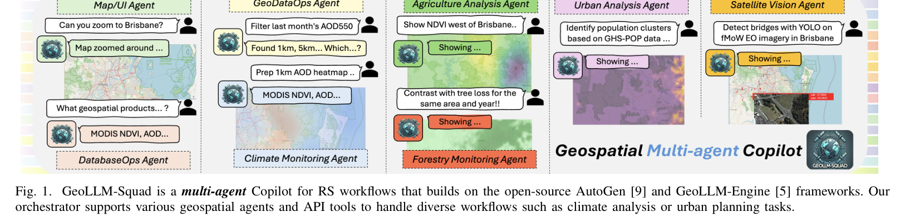
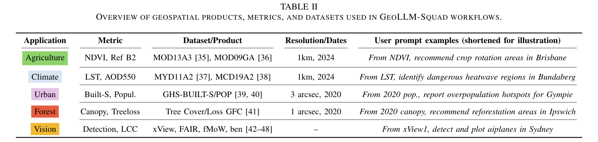
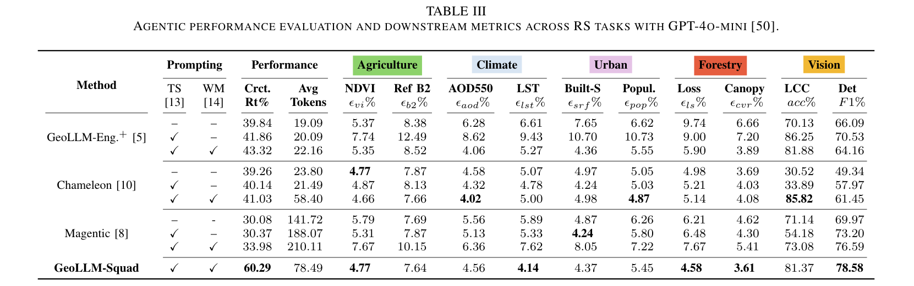
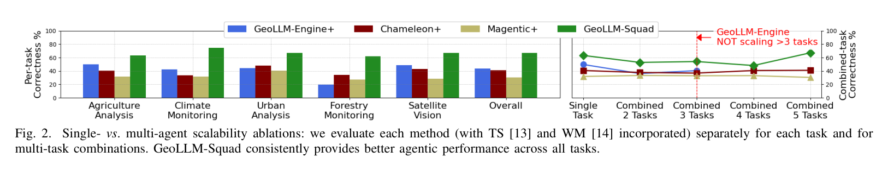
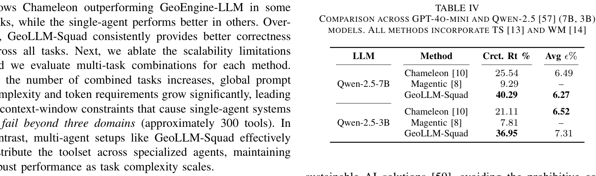

# 汇报卡片 C1：GeoLLM-Squad（遥感落地 · 多智能体地理空间 Copilot）

> 论文：Multi-Agent Geospatial Copilots for Remote Sensing Workflows
> 作者：Chaehong Lee, Varatheepan Paramanayakam, Andreas Karatzas 等（UT Austin / Southern Illinois University / **Microsoft**）· arXiv:2501.16254 · 2025
> 本地 PDF：`papers/Soni 等 - 2025 - Multi-Agent Geospatial Copilots for Remote Sensing Workflows.pdf`
> 汇报定位：**唯一一篇把多智能体用在我研究的领域、并给出量化提升的论文**。它回答的正是我的核心疑问——"多智能体到底比单智能体强在哪、强多少"。

---

## P1 动机与难点

### 这篇论文要解决什么问题
遥感工作流本身很复杂——需要多种数据、工具和分析方法，还要有隐性的地学专业知识。举例：同一片区域，若云量超过阈值，地学家会用**地面站温度数据或 SAR 影像**替代地表温度（SLT）产品和光学影像。这种"**SAR-over-EO**"的隐性判断逻辑，很难通过提示词硬塞给现有的地理空间 Copilot。

### 难点（论文自己点名的）
1. **单体 LLM 是瓶颈**：有限上下文窗口和 token 容量，撑不起真实遥感应用需要的时空尺度。
2. **专业逻辑难以提示词化**：像"云量高就换 SAR"这种条件判断，靠堆 prompt 无法稳定实现。
3. **工具规模爆炸**：任务一多，工具数量从几十涨到几百，单体 Agent 的上下文装不下。
4. **云端成本**：论文特别指出，要求必须用 GPT 级模型做编排，对地学家来说成本太高——所以多智能体系统还必须能跑在**开源小模型（SLM）**上。

### 研究目的
提出 **GeoLLM-Squad**：把"**智能体编排**"和"**地理空间任务求解**"**拆开**——主 Agent 只负责拆解任务和调度，具体任务交给一个个专职 sub-agent。以此突破单体 LLM 的上下文瓶颈。

---

## P2 模型

### 核心思路：编排与求解分离
这是全篇最重要的一句话：**Unlike existing single-agent approaches that rely on monolithic LLM, GeoLLM-Squad separates agentic orchestration from geospatial task-solving.**

- **Orchestrator（编排者）**：接收用户请求 → 分解成子任务 → 为每个子任务生成清晰提示 → **安排执行顺序**（例如必须先 load 再 filter）。
- **专职 Sub-agents**：每个子任务交给一个专职 Agent，各自持有自己的**专属工具集**。

### 六类 Agent（Figure 1）
| Agent | 职责 |
|---|---|
| **Map / UI Agent** | 地图交互（如"缩放到布里斯班"） |
| **GeoDataOps Agent** | 数据操作（筛选月份、准备热力图） |
| **DatabaseOps Agent** | 数据产品查询（有哪些 MODIS 产品可用） |
| **Agriculture Analysis Agent** | 农业分析（NDVI 聚类、轮作推荐） |
| **Climate Monitoring Agent** | 气候监测（AOD550、LST） |
| **Forestry Monitoring Agent** | 林业监测（树冠覆盖、树损对比） |
| **Urban Analysis Agent** | 城市分析（人口热点） |
| **Satellite Vision Agent** | 卫星视觉（YOLO 检测桥梁等） |

### 两项提升提示的能力（可借鉴到我的工作）
- **TS（Intent-based Tool Selection，意图式工具选择）**：用相似度检索从一个"提示-方案"训练集里找最像的例子，给**单个 Agent 内部**做 few-shot 引导。
- **WM（Workflow Memory，工作流记忆）**：在**工作流层面**积累提示-方案对，给**跨 Agent**做 few-shot 引导。

> TS 管"这个 Agent 该用哪个工具"，WM 管"这个流程该怎么做"——一个管内部、一个管跨 Agent，两者正交。

### 技术栈
建在两套开源框架上：**GeoLLM-Engine 当前端**（交互式地图 UI + 对话式功能 + API 工具），**AutoGen 当后端**（LLM function-calling 实现多智能体通信与编排）。**这和卡片 A3 的 AutoGen 直接串起来了**。

### 对着图怎么讲
- **Figure 1**：底部一排是六类专职 Agent 的对话示例（Map/UI、GeoDataOps、DatabaseOps、Agriculture、Climate、Urban、Forestry、Satellite Vision），右下角是 GeoLLM-Squad 的编排器。**这张图讲"任务怎么被拆给不同专家"**。
- **Figure 2**：左半边是五个任务上各方法的正确率柱状图；右半边是关键——**任务数从 1 增加到 5 时各方法的正确率曲线**。

*Figure 1｜六类专职 Agent + 编排器，建在 AutoGen 与 GeoLLM-Engine 之上。来源：arXiv:2501.16254, p.2*

---

## P3 实验结果

### 任务与数据（Table II）
五个真实遥感工作流，覆盖澳大利亚东部：
| 应用 | 指标 | 数据产品 | 分辨率 |
|---|---|---|---|
| Agriculture 农业 | NDVI、Ref B2 | MOD13A3、MOD09GA | 1km, 2024 |
| Climate 气候 | LST、AOD550 | MYD11A2、MCD19A2 | 1km, 2024 |
| Urban 城市 | Built-S、人口 | GHS-BUILT-S/POP | 3 arcsec, 2020 |
| Forest 林业 | 树冠、树损 | Tree Cover/Loss GFC | 1 arcsec, 2020 |
| Vision 视觉 | 检测、LCC | xView、FAIR1M、fMoW、BigEarthNet | — |

*Table II｜五类遥感工作流的指标、数据产品与示例提示。来源：arXiv:2501.16254, p.2*

### 主实验：正确率 + 成本（Table III，GPT-4o-mini）

*Table III｜主实验：与单智能体 GeoLLM-Engine、多智能体 Chameleon / Magentic 的完整对比。来源：arXiv:2501.16254, p.3*

| 方法 | 类型 | **正确率 Crct.Rt%** | Avg Tokens |
|---|---|---|---|
| GeoLLM-Engine⁺ | **单 Agent** | 39.84 / 41.86 / **43.32** | 19–22k |
| Chameleon | 多 Agent | 39.26 / 40.14 / 41.03 | 24–58k |
| Magentic | 多 Agent | 30.08 / 30.37 / 33.98 | **142–210k** |
| **GeoLLM-Squad** | 多 Agent | **60.29** | 78.49k |

**三个最该讲的数字**：
1. **正确率 60.29% vs 单 Agent 43.32%** —— 论文口径的"**17% 提升**"。
2. **Magentic 是反面教材**：token 花了 **21 万**，正确率只有 **33.98%**。原因：**过多重试循环和反复重规划**。→ 说明"多智能体"本身不保证更好，**编排机制才是关键**。
3. **GeoLLM-Squad 用 78k token 拿到 60.29%**，比 Chameleon（58k / 41.03%）贵一些但正确率高出近 20 个点——**性价比明显更优**。

### 主实验二：单 vs 多智能体的**扩展性消融**（Figure 2，最值得讲的一张）

*Figure 2｜左：五个任务各自的正确率；右：任务数从 1 增到 5 时的组合任务正确率。来源：arXiv:2501.16254, p.4*

**结论（论文原话要点）**：
> 随着组合任务数增加，全局提示复杂度和 token 需求显著增长，**单智能体系统在超过三个领域（约 300 个工具）后就会失效**；而多智能体把工具集分散到专职 Agent 上，**能在任务复杂度上升时保持稳定性能**。

**这就是"多智能体到底强在哪"的实证答案**：不是单任务更强，而是**能扛住复杂度增长**。

### 动机实验：换成开源小模型会怎样（Table IV）

*Table IV｜GPT-4o-mini 与 Qwen-2.5（7B / 3B）上的正确率对比。来源：arXiv:2501.16254, p.4*

| LLM | 方法 | 正确率 % |
|---|---|---|
| Qwen-2.5-7B | Chameleon | 25.54 |
| Qwen-2.5-7B | Magentic | **9.29**（几乎等于噪声） |
| Qwen-2.5-7B | **GeoLLM-Squad** | **40.29** |
| Qwen-2.5-3B | Chameleon | 21.11 |
| Qwen-2.5-3B | Magentic | 7.81 |
| Qwen-2.5-3B | **GeoLLM-Squad** | **36.95** |

**结论**：换成小模型后，**Chameleon 掉最多 20 个点，Magentic 直接崩到 9% 以下**，而 GeoLLM-Squad 7B 版还能达到 GPT 驱动的 Chameleon 水平。→ **编排机制越依赖强模型，越不能落地**；这也是我能用得起实验的前提。

### 评价指标（对我很有参考价值）
- **Agentic Correctness（智能体正确率）**：**正确工具调用步骤的比例**——即"是否按预期顺序调用了正确的函数"。这是**过程指标**，不是答案对错。
- **ϵ（mean-square percentage error）**：把 Agent 实际访问的数据点与"金标准"数据点比较，缺失项算误差，跨 2000 条提示计算。
- 论文明确说：这类指标比"任务成功率"或"文本相似度"**更能反映对下游任务的影响**。

---

## 一句话总结
GeoLLM-Squad 把"编排"从"求解"里拆出来，用专职 sub-agent 分摊工具集，在真实遥感工作流上把正确率从 43% 提到 **60%（+17%）**；更关键的是它证明了**多智能体的优势不在单任务更强，而在任务复杂度增长时不崩**——这正好给了我的"用多智能体纠偏遥感模型"一个可引用的量化依据。
