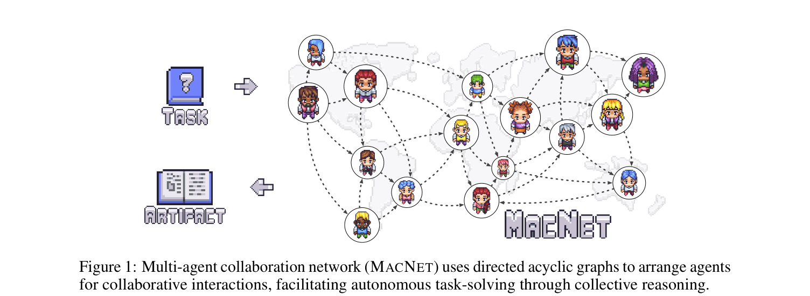
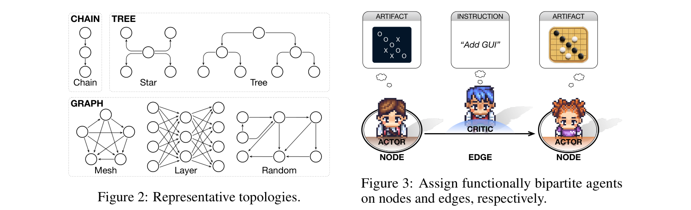
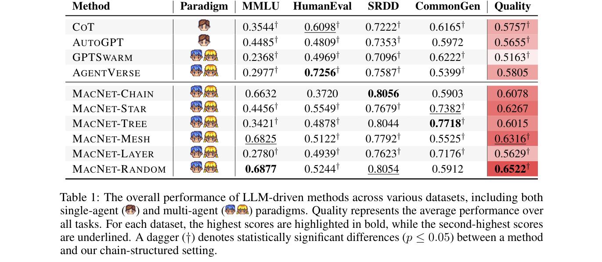

# 汇报卡片 3：MacNet（协作机制 · 规模扩展）

> 论文：Scaling Large Language Model-based Multi-Agent Collaboration
> 作者：Chen Qian, Zihao Xie 等（清华大学等）· ICLR 2025 · arXiv:2406.07155
> 本地 PDF：`papers/Qian 等 - 2024 - MacNet Scaling Large Language Model-based Multi-Agent Collaboration.pdf`
> 汇报定位：代表「**多智能体能扩到多大、扩了有没有用**」这一问。它把「神经网络的 scaling law」类比到「智能体数量的 scaling law」。

---

## P1 动机与难点

### 这篇论文要解决什么问题
神经网络的 scaling law 说：加神经元，性能持续涨。那么**加 Agent 呢？** 多智能体协作常被认为能超越单个智能体，但没人系统回答过：Agent 数量从几个加到上千个，性能怎么变？会不会崩？该用什么拓扑组织它们？

### 难点（论文自己点名的）
1. **规模瓶颈**：Agent 之间两两交互时，上下文长度随 n² 增长，导致时间和成本平方级爆炸，规模上不去。
2. **拓扑没有定论**：直觉上交互越密（mesh）越好，但实际不是——需要实验验证不同拓扑的优劣。
3. **规模与拓扑的取舍**：不能只看数量，还要看"形状"（谁连谁）和"密度"（连多少）。
4. **缺少 scaling 视角**：此前多智能体研究都在 3–5 个 Agent 的小规模上做，没有规模规律。

### 研究目的
用有向无环图（DAG）把 Agent 组织成协作网络，系统研究「**Agent 数量**」和「**网络拓扑**」两个变量对任务质量的影响，并给出可用的规模规律。

---

## P2 模型

### 核心机制一：MACNET（多智能体协作网络）
- 用**有向无环图（DAG）**组织 Agent：每个节点是一个 Agent，每条有向边表示一次"批评—改进"的推理交互。
- 交互推理沿拓扑**顺序编排**：上游 Agent 产出初稿，下游 Agent 逐层反思、细化，最后汇聚成完整产物。
- 与 MetaGPT/ChatDev 不同：它**不预设角色分工**，而是让功能二分（actor 产出 / critic 提意见），拓扑决定信息怎么流动。

### 核心机制二：拓扑结构（6 种）
| 拓扑 | 形状 | 适用 |
|---|---|---|
| Chain | 链式，类似瀑布模型 | 软件开发（有严格先后依赖） |
| Tree | 树形，分叉再汇聚 | 创意写作（发散后收敛） |
| Star | 星形，中心节点辐射 | 需要中心汇总 |
| Layer | 分层 | 层级汇报 |
| Mesh | 网状，两两全连 | 交互最密，但**不是最优** |
| Random | 随机删边但保持连通 | 综合表现最好 |

### 核心机制三：上下文长度解耦
- 不加控制时，上下文长度随 Agent 数 n² 增长（每个 Agent 都要看到所有历史）。
- MacNet 的解耦机制把上下文增长从**平方级降到线性级**，这是能扩到千级 Agent 的关键工程手段。

### 对着图怎么讲（Figure 1 / Figure 2）

*Figure 1｜MACNET 用有向无环图组织 Agent，任务是输入、产物是输出。来源：MacNet, ICLR 2025, p.1*

*Figure 2/3｜左：六种代表性拓扑（Chain/Tree/Star/Graph: Mesh/Layer/Random）；右：节点放 actor，边放 critic。来源：MacNet, ICLR 2025, p.3*
- Figure 1：DAG 把 Agent 排成网络，边就是"批评与改进"的推理交互。
- Figure 2：六种代表性拓扑的示意图——**Chain 是瀑布模型，Tree 是分叉汇聚**。
- 一句话：**别的论文设计 Agent 之间的对话，这篇设计 Agent 之间的图。**

---

## P3 实验结果

### 主实验一：Chain 拓扑已超越所有基线（Table 1，Quality 列）

| 方法 | 类型 | MMLU | HumanEval | SRDD | CommonGen | Quality（平均） |
|---|---|---|---|---|---|---|
| COT | 单 Agent | 0.3544 | 0.6098 | 0.7222 | 0.6165 | 0.5757 |
| AutoGPT | 单 Agent | 0.4485 | 0.4809 | 0.7353 | 0.5972 | 0.5655 |
| GPTSwarm | 多 Agent | 0.2368 | 0.4969 | 0.7096 | 0.6222 | 0.5163 |
| AgentVerse | 多 Agent | 0.2977 | 0.7256 | 0.7587 | 0.5399 | 0.5805 |
| MacNet-Chain | 多 Agent | 0.6632 | 0.3720 | 0.8056 | 0.5903 | 0.6078 |
| MacNet-Star | 多 Agent | 0.4456 | 0.5549 | 0.7679 | 0.7382 | 0.6267 |
| MacNet-Tree | 多 Agent | 0.3421 | 0.4878 | 0.8044 | 0.7718 | 0.6015 |
| MacNet-Mesh | 多 Agent | 0.6825 | 0.5122 | 0.7792 | 0.5525 | 0.6316 |
| MacNet-Layer | 多 Agent | 0.2780 | 0.4939 | 0.7623 | 0.7176 | 0.5629 |
| **MacNet-Random** | 多 Agent | 0.6877 | 0.5244 | 0.8054 | 0.5912 | **0.6522**（最高） |

> 表注：† 表示与 chain 结构有统计显著差异（p≤0.05）。**最高分在 Random，不是规则拓扑。**

**两个关键结论**：
1. **在多数指标上，MacNet 的各个拓扑都超过单 Agent 与已有 MAS 基线**（COT / AutoGPT / GPTSwarm / AgentVerse）。
2. **不规则拓扑（Random）优于规则拓扑**：直觉上最密的 Mesh 并不是最好的（0.6316 < 0.6522）。
   论文解释：交互过密会造成**信息过载**，反而妨碍 Agent 的反思与细化；而随机化容易产生**小世界性质**，兼顾连通性与效率。
3. **拓扑要按任务选**：chain 更适合软件开发（SRDD 0.8056），tree 更适合创意写作（CommonGen 0.7718）。

### 主实验二：协作 scaling law（Figure 7）
- 把节点数 |V| 从 2⁰（退化为单 Agent）指数增加到 2⁶（mesh 下超过一千个 Agent）。
- 性能曲线：**先缓慢上升 → 快速提升 → 到达饱和**，服从一个 sigmoid 变体：
  `f(|V|) = γ / (1 + e^(−β(log|V| − α))) + δ`
- **实用结论**：节点量级 **2⁴（约 16 个）** 是性价比合理的选择。
- **协作涌现（collaborative emergence）比神经网络的涌现来得更早**：神经网络要十亿参数、10²² FLOPs 才出现涌现，而 Agent 协作在小得多的规模就出现了。

### 动机实验：为什么规模能带来提升
- 交互轮次增加 → Agent 之间**讨论的方面（interacted aspects）数量**急剧上升（从个位数涨到数千）。
- 方面数量的增长曲线与能力涌现曲线形状一致，说明**涌现可能来自"被讨论到的细节维度"的激增**。
- 统计发现：当 critic 提出某个改进点，actor 有 **93.10%** 的概率真的去实现它——即"批评-改进"链路是真实生效的。
- 但上下文长度若不加控制会平方级增长，因此**规模可达性的前提是上下文解耦**。

### 数据集 / 评价指标
MMLU（知识推理）、HumanEval（代码）、SRDD（仓库级软件开发，用完整性/可执行性/一致性综合指标）、CommonGen-Hard（概念到连贯句子，用语法/流畅度/上下文相关性/逻辑一致性综合指标）；主指标为 Quality（各任务指标平均）。默认用 GPT-3.5，每轮交互限制 3 次交换。

---

## 一句话总结

*Table 1｜主实验：COT / AutoGPT / GPTSwarm / AgentVerse 四类基线与 MacNet 六种拓扑的完整对比，MacNet-Random 的 Quality 0.6522 为全场最高。来源：MacNet, ICLR 2025, p.6*
MacNet 把「多智能体能扩多大」变成了一个可测量的规律：**斜 S 形增长、随机拓扑最优、2⁴ 个 Agent 是甜点、协作涌现比参数涌现更早到来。**
