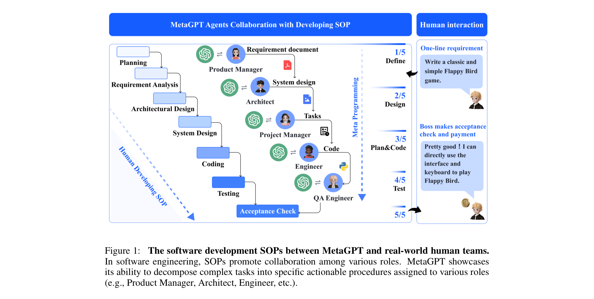
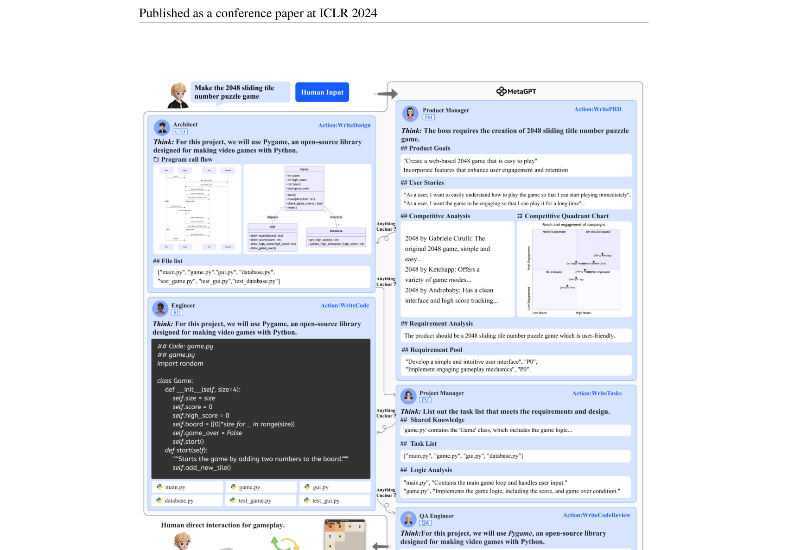
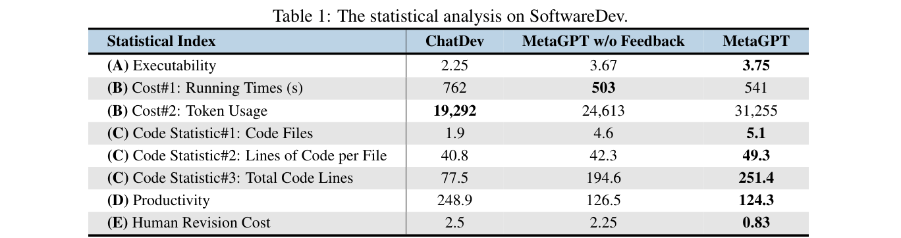
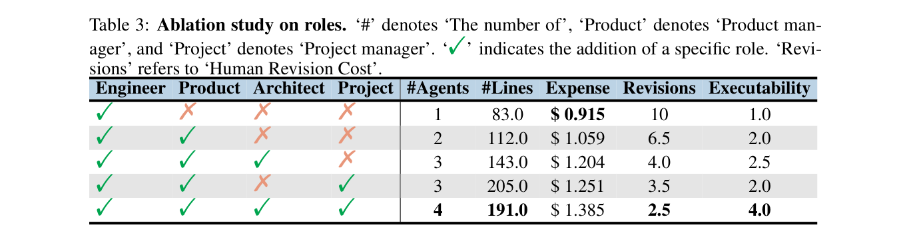

# 汇报卡片 A1：MetaGPT（协作机制 · SOP 流水线）

> 论文：MetaGPT: Meta Programming for A Multi-Agent Collaborative Framework
> 作者：Sirui Hong, Mingchen Zhuge, Jiaqi Chen, Xiawu Zheng, Yuheng Cheng 等（DeepWisdom / KAUST 等，共 15 位）· ICLR 2024 · arXiv:2308.00352
> 本地 PDF：`papers/Hong 等 - 2024 - MetaGPT Meta Programming for A Multi-Agent Collaborative Framework.pdf`
> 汇报定位：代表「**把人类团队的 SOP 编码进多智能体**」这一条路线，是「结构化流程」路线的代表，也是 ChatDev 的直接对照对象。
> 论文全文精读见：`notes/MetaGPT论文精读.md`

---

## P1 动机与难点

### 这篇论文要解决什么问题
简单串联多个 Agent 让它们自由聊天，会出现**信息歧义、错误传播与级联幻觉**。MetaGPT 的观察是：人类软件团队之所以高效，靠的是**标准操作流程（SOP）+ 明确的中间交付物**。所以它把 SOP 编码进 Prompt、Role、Action 与 Message。

### 难点（论文自己点名的）
1. **多 Agent 自由对话没有全局约束**，容易跑偏、重复劳动、需求理解不一致。
2. **纯自然语言接口信息密度低**，一个 Agent 的错误成为下一个的输入，错误沿对话链放大（级联幻觉）。
3. **生成结果不可执行时缺少自动纠正环节**——"代码看起来合理"不等于"代码能跑"。
4. **角色分工与成本存在矛盾**：多加角色能提升质量，但费用随之上升。

### 研究目的
提出 `Code = SOP(Team)` 的元编程框架：用**结构化中间产物**替代自由文本，用**可执行反馈**替代人工检查，把"多人协作"变成可复现的流程。

---

## P2 模型

### 四个核心机制
| 机制 | 做法 |
|---|---|
| **Role 角色分工** | 产品经理 → 架构师 → 项目经理 → 工程师 → QA；每个角色有 profile / goal / constraints / skills / actions / memory |
| **SOP 标准流程** | 规定谁先工作、依赖谁、输出必须含什么字段、何时可以启动（如架构师不能在收到 PRD 前开始设计） |
| **结构化通信** | Agent 之间传 PRD、系统设计、接口定义、任务列表、测试报告等**中间交付物**，而非自由文本 |
| **可执行反馈** | 生成代码 → 运行 / 单测 → 读错误 → 改代码 → 再运行，最多重试 3 次 |

另有 **Publish-Subscribe 共享消息池**：Agent 发布结构化消息，其余按订阅关系取用，把连接数从 O(n²) 降到 O(n)，降低信息过载。

### 对着图怎么讲
- **Figure 1**：左边是真实人类团队的开发 SOP（Planning → Requirement Analysis → Architectural Design → System Design → Coding → Testing → Acceptance Check），右边是 MetaGPT 的对应角色与结构化产物。**这张图讲"人怎么协作 → 机器怎么协作"的映射**。
- **Figure 3**：一个完整开发实例。PM 产出 PRD（目标 / 用户故事 / 竞品分析 / 需求池）、架构师产出文件列表与数据结构、项目经理产出任务列表与逻辑分析、工程师产出代码、QA 写测试。**这张图讲"每一步交接的都是文档，不是聊天记录"**。

*Figure 1｜左：真实人类团队开发 SOP；右：MetaGPT 的角色与结构化产物。来源：MetaGPT, ICLR 2024, p.2*

*Figure 3｜PM → 架构师 → PM → 工程师 → QA 的交接细节，每步产出结构化文档。来源：MetaGPT, ICLR 2024, p.5*

### 与 ChatDev 的关键差异（放一起讲最有说服力）
| | MetaGPT | ChatDev |
|---|---|---|
| 协调靠什么 | SOP + **结构化文档** | Chat Chain + **多轮对话** |
| 传递什么 | PRD / 设计 / 任务列表 / 测试报告 | 自然语言（57.5%）+ 编程语言 |
| 防幻觉 | 可执行反馈（跑测试读错误） | 交际式去幻觉（先问再答） |
| 实验结论 | 可执行性高、人工返工少 | Executability 更高、成本更低 |

---

## P3 实验结果

### 主实验一：代码生成（HumanEval / MBPP）
- **HumanEval Pass@1 = 85.9%**，**MBPP Pass@1 = 87.7%**（单次尝试）。
- 对比 GPT-4（HumanEval 67.0%）提升约 **18.9 个百分点**。
- 去掉可执行反馈后降到 **81.7% / 82.3%** —— 说明"能跑起来"是质量提升的主要来源。

### 主实验二：真实开发任务（SoftwareDev，70 个任务）

*Table 1｜SoftwareDev 统计对比。来源：MetaGPT, ICLR 2024, p.8*

| 指标 | ChatDev | MetaGPT w/o Feedback | MetaGPT |
|---|---|---|---|
| (A) 可执行性（1–4 分） | 2.25 | 3.67 | **3.75** |
| (B) 运行时间（秒） | 762 | **503** | 541 |
| (B) Token 用量 | **19,292** | 24,613 | 31,255 |
| (C) 代码文件数 | 1.9 | 4.6 | **5.1** |
| (C) 每文件代码行数 | 40.8 | 42.3 | **49.3** |
| (C) 总代码行数 | 77.5 | 194.6 | **251.4** |
| (D) 生产率（token/行） | 248.9 | 126.5 | **124.3** |
| (E) 人工修复成本 | 2.5 | 2.25 | **0.83** |

**最值得讲的三个数字**：
1. **可执行性 3.75 / 4**（ChatDev 2.25）——接近"无缺陷"。
2. **人工修复成本 0.83**（ChatDev 2.5）——可执行反馈把人工返工压掉约 2/3。
3. **每行代码 124.3 token**（ChatDev 248.9）——总 token 用量更高，但**单位产出的成本更低**。

### 动机实验：角色分工消融

*Table 3｜角色消融：逐步加入 Architect / Project Manager / Product Manager。来源：MetaGPT, ICLR 2024, p.9*

| Engineer | Product | Architect | Project | #Agents | #Lines | Expense | Revisions | Executability |
|---|---|---|---|---|---|---|---|---|
| ✔ | ✘ | ✘ | ✘ | 1 | 83.0 | $0.915 | 10 | 1.0 |
| ✔ | ✔ | ✘ | ✘ | 2 | 112.0 | $1.059 | 6.5 | 2.0 |
| ✔ | ✔ | ✔ | ✘ | 3 | 143.0 | $1.204 | 4.0 | 2.5 |
| ✔ | ✔ | ✘ | ✔ | 3 | 205.0 | $1.251 | 3.5 | 2.0 |
| ✔ | ✔ | ✔ | ✔ | 4 | 191.0 | $1.385 | **2.5** | **4.0** |

**结论**：**合理角色分工提升质量但增加成本**；**可执行反馈显著降低人工修复**（2.25 → 0.83）。

### 数据集 / 评价指标
HumanEval（164 题）、MBPP（427 题）、自建 SoftwareDev（70 个真实开发任务，取 7 个代表任务对比）；指标为 Pass@1、可执行性 1–4 分、Token 用量、人工修复次数、生产率（token/行）。

---

## 一句话总结
MetaGPT 证明了**结构化流程本身就是性能来源**：把 SOP 写进多智能体、让 Agent 传文档而不是聊天、再用可执行反馈闭环，就能拿到更高的可执行性和更低的人工返工。
